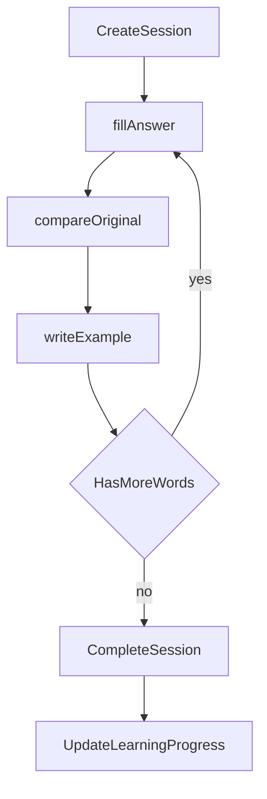

# Phase 2 — Vocabulary Quiz

## Mục tiêu

Quiz theo chủ đề từ trang chi tiết topic: mỗi từ 3 bước bắt buộc, chấm điểm AI/heuristic, ngưỡng đậu 75%, cập nhật `learning_progress`, gợi ý từ ôn lại.

## Phạm vi

### In scope

- Bảng `quiz_sessions`, `quiz_session_questions`, `learning_progress`
- API tạo session, submit từng bước, complete, progress
- API `grade-example`, `sentence-hint`
- `services/ai_grader.py` — Ollama + fallback
- UI `TopicQuizModal` trên topic detail
- **Session persist PostgreSQL** (không in-memory)

### Out of scope

- Standalone route `/vocabulary/quiz`
- Adaptive spaced repetition nâng cao

## Checklist triển khai

### Backend / DB

- [ ] Models `QuizSession`, `QuizSessionQuestion`, `LearningProgress`
- [ ] Schemas quiz + progress (xem [backend-spec.md](../preview-dev/backend-spec.md))
- [ ] `ai_grader.py` — `grade_sentence`, `compare_meaning`, `generate_sentence_hint_vi`
- [ ] Routes quiz + complete + progress
- [ ] Logic chọn `question_count` từ random vocab trong topic
- [ ] Scoring per step; aggregate score; pass threshold **75**
- [ ] Complete: xóa hoặc archive session row; upsert `learning_progress` (`item_type=topic_quiz`)
- [ ] `recommended_review_vocab_ids` — từ score thấp

### Frontend

- [ ] `components/vocabulary/topic-quiz-modal.tsx`
- [ ] State machine UI: fillAnswer → compareOriginal → writeExample → next word
- [ ] Gọi API submit-step; hiển thị feedback AI (tiếng Việt, không lộ model)
- [ ] Bước writeExample: grade-example + nút "Gợi ý câu" (sentence-hint)
- [ ] Màn hình kết quả: điểm, đậu/trượt, danh sách từ nên ôn
- [ ] Nút "Làm quiz" trên `vocabulary-topic-detail-page`

## State machine



## API contract

### POST `/api/topics/{topic_id}/quiz-sessions`

Body:

```json
{
  "user_id": "guest-user",
  "question_count": 10
}
```

Response `QuizSessionOut`:

```json
{
  "session_id": "abc123...",
  "topic_id": 1,
  "user_id": "guest-user",
  "started_at": "2026-06-06T10:00:00",
  "questions": [
    {
      "vocabulary_id": 42,
      "word": "allocate",
      "phonetic": "/ˈæləkeɪt/",
      "prompt": "Điền nghĩa tiếng Việt và loại từ",
      "step_order": ["fillAnswer", "compareOriginal", "writeExample"]
    }
  ]
}
```

### POST `/api/quiz-sessions/{session_id}/submit-step`

Body:

```json
{
  "vocabulary_id": 42,
  "step": "fillAnswer",
  "meaning_input": "phân bổ",
  "word_type_input": "verb"
}
```

Response `QuizStepSubmitOut`: `is_correct`, `score_delta`, `feedback`, optional AI match fields.

Steps:

| Step | Input | Scoring |
|------|-------|---------|
| `fillAnswer` | meaning + word_type | So khớp expected |
| `compareOriginal` | — | Completion / AI semantic compare |
| `writeExample` | `example_input` | Gọi grade-example |

### POST `/api/vocabularies/{vocabulary_id}/grade-example`

Body: `{ "user_id": "guest-user", "sentence": "..." }`

Response: `score` 0–100, `feedback`, `corrected_sentence`, `passed`, `ai_provider`, `model`.

### POST `/api/vocabularies/{vocabulary_id}/sentence-hint`

Body: `{ "word": "allocate" }`

Response: `{ "hint_vi": "...", "ai_provider", "model" }`

### POST `/api/topics/{topic_id}/quiz-sessions/{session_id}/complete`

Response:

```json
{
  "session_id": "...",
  "score": 82.5,
  "pass_threshold": 75,
  "passed": true,
  "total_questions": 10,
  "completed_questions": 10,
  "recommended_review_vocab_ids": [3, 7]
}
```

### GET `/api/topics/{topic_id}/progress?user_id=guest-user`

Response `LearningProgressOut` cho `item_type=topic_quiz`.

## AI rubric (grade-example)

- Grammar: 40 điểm
- Word usage (target word): 35 điểm
- Clarity: 25 điểm
- `passed`: score ≥ ngưỡng nội bộ (thường 60+ cho câu đơn)

Ollama khi `AI_ENABLE_OLLAMA=true`; else heuristic (`ai_provider: heuristic`).

## UI contract

- Modal overlay; progress bar số câu / bước.
- Bước 1: input nghĩa VI + loại từ (select/text).
- Bước 2: hiển thị đáp án gốc, xác nhận so sánh.
- Bước 3: textarea câu ví dụ tiếng Anh + nút gợi ý.
- Kết thúc: card kết quả pastel; list từ cần ôn link về detail.

## Lệnh verify

```bash
# Tạo session
curl -X POST http://127.0.0.1:5201/api/topics/1/quiz-sessions \
  -H "Content-Type: application/json" \
  -d '{"user_id":"guest-user","question_count":3}'

# Submit step (thay SESSION_ID, vocabulary_id)
curl -X POST http://127.0.0.1:5201/api/quiz-sessions/SESSION_ID/submit-step \
  -H "Content-Type: application/json" \
  -d '{"vocabulary_id":1,"step":"fillAnswer","meaning_input":"test","word_type_input":"noun"}'

# Complete
curl -X POST http://127.0.0.1:5201/api/topics/1/quiz-sessions/SESSION_ID/complete

# FE: topic detail → Làm quiz → hoàn thành flow 3 bước × N từ
# Restart backend → session cũ vẫn trong DB hoặc đã complete (không mất logic in-memory)
```

## Backfill preview-spec sau khi code

- [database-ai-local-spec.md](../preview-dev/database-ai-local-spec.md)
- [backend-spec.md](../preview-dev/backend-spec.md)
- [frontend-spec.md](../preview-dev/frontend-spec.md)

## Liên kết

- Phase trước: [1-Vocabulary_browsing.md](./1-Vocabulary_browsing.md)
- Phase sau: [3-Passive_listening.md](./3-Passive_listening.md)
